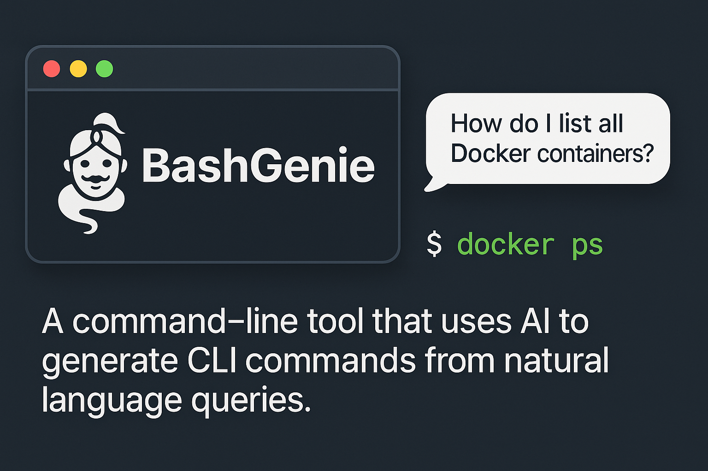

# BashGenie

**BashGenie** is a command-line tool powered by AI that translates your natural language questions into accurate and efficient CLI commands. 
Simply ask a question, and let BashGenie generate the perfect command for you!

> **Inspired by** [yolo-ai-cmdbot](https://github.com/wunderwuzzi23/yolo-ai-cmdbot)



## Table of Contents
- [BashGenie](#bashgenie)
  - [Table of Contents](#table-of-contents)
  - [Initial Setup](#initial-setup)
  - [Usage](#usage)
  - [Caution](#caution)

---

## Installing from source code

```sh
nvm use
npm run build
npm i -g .
```

## Initial Setup

Before using BashGenie, you'll need to run the configuration wizard to set it up. Use the following command to initialize:

```sh
bashgenie --init
```

## Usage

```bash
bashgenie [OPTIONS] <YOUR QUESTION>
```

**Options**

`-h, --help`
Show this help message and exit.

`-e, --explain`
Provide a detailed explanation of the generated command, including a breakdown of each component and why it was selected.

`-v, --verbose`
Display additional information (e.g., token usage) for a deeper understanding of the tool’s internal workings.

`-c, --show-conf`
Show the current configuration settings.

`--init`
Run the setup wizard to configure the tool. Use this if you're a first-time user or need to adjust your settings.

`--no-exec`
Prevent the tool from executing the generated command. It will only display the command and exit without asking for confirmation.


## Caution

> [!CAUTION]
> <u>**Always carefully review the generated command before executing it.**</u> While BashGenie is designed to generate safe and useful commands, it's crucial to ensure that the output aligns with your specific needs and context.
>
> **No command will be executed automatically.** BashGenie will always prompt you for confirmation before running any generated command, allowing you to verify its accuracy and relevance. 
> Additionally, during the command generation process, BashGenie will provide an estimate of the command's potential "**dangerousness**." Commands identified as risky or potentially harmful will not prompt you for confirmation and will be flagged accordingly. 

<!-- # Resources
Additional and learning resources:
- https://www.totaltypescript.com/how-to-create-an-npm-package
- https://hackernoon.com/publishing-a-nodejs-cli-tool-to-npm-in-less-than-15-minutes
- https://blog.logrocket.com/building-typescript-cli-node-js-commander/#making-cli-globally-accessible -->
